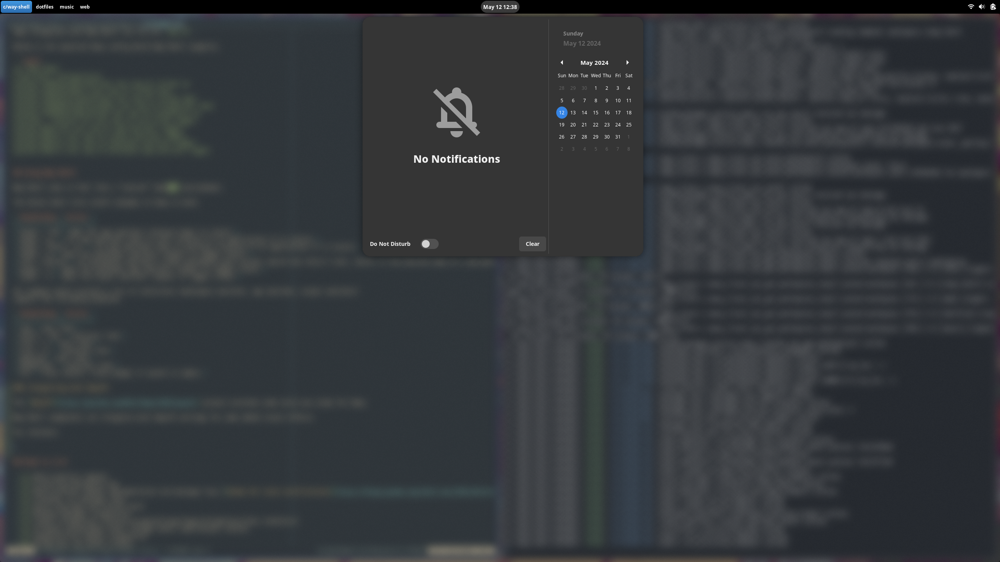

# Way-Shell

[](https://copr.fedorainfracloud.org/coprs/ldelossa/Way-Shell/package/way-shell/)

A Gnome inspired desktop shell for Wayland compositors/window managers written
in C and Gtk4.

Way-Shell expects a Gnome-like environment to be available.
This means DBus must be running and the following services must be available:

- Logind
- NetworkManager
- WirePlumber/Pipewire
- PowerProfiles Daemon
- UPower

If you're using Fedora these services should be available by default.

Currently Way-Shell only supports Sway but this will change as the project
matures.

Way-Shell is in its very early stages of development so expect some crashes and
bugs. However, it is my daily driver and I'm rather quick to fix show stopper
issues.

The demo above is using [SwayFX](https://github.com/WillPower3309/swayfx) which I really enjoy.

## Installing and Running Way-Shell 

A [copr](https://copr.fedorainfracloud.org/coprs/ldelossa/Way-Shell/) exists for installing Way-Shell on Fedora. 

Way-Shell currently targets Fedora 40 and will not work with previous version. 

An [AUR package](https://aur.archlinux.org/packages/way-shell-git) also exists for Arch-based distros, which can be installed with any AUR helper, or with `makepkg` if you're feeling lucky.

Other distros will need to build Way-Shell from source. 

The repository is rather self contained and the dependencies are listed at the top of the Makefile.

Contributions are very welcome if you're using Way-Shell on a distro other then Fedora!

## Video Demonstration

[](https://www.youtube.com/watch?v=sOooD4Q3mYU)

## Configuring Sway

Sway is the ultimate controller of keybinds and must be configured to
specifically work with Way-Shell.

Sway integrates with Way-Shell via its CLI `way-sh`.

Below is the expected Sway config which Way-Shell supports.

```shell
set $mod Mod4
# way-shell configuration
bindsym XF86AudioRaiseVolume exec way-sh volume up
bindsym XF86AudioMute exec way-sh volume mute
bindsym XF86AudioLowerVolume exec way-sh volume down
bindsym XF86MonBrightnessDown exec way-sh brightness down
bindsym XF86MonBrightnessUp exec way-sh brightness up
bindcode --release 133 exec way-sh activities toggle
bindsym $mod+Tab exec way-sh app-switcher toggle
bindsym $mod+o exec way-sh output-switcher toggle
bindsym $mod+w exec way-sh workspace-switcher toggle
bindsym $mod+a exec way-sh workspace-app-switcher toggle
```

## Using Way-Shell

Way-Shell aims to feel like a "natural" desktop environment.

The below table lists useful keymaps to keep in mind.

| Keybinding | Action |
|------------|--------|
| Super + Tab | Open the app switcher (release Super to close) |
| Super + g  | (In app switcher) move to next instance of an application if it exists |
| Super + Shift + g  | (In app switcher) move to previous instance of an application if it exists |
| Super + w | Open the workspace switcher (repeat to toggle close) |
| Ctrl + Return | (In workspace switcher) create workspace with current search bar entry's text, useful if the desired name of a new workspace overlaps with an existing one. |
| Super + a | Open the workspace app switcher (repeat to toggle close) |
| Super + o | Open the output switcher (repeat to toggle close) |

All widgets which provide a list of selections (workspace switcher, app switcher, output switcher)
support the following keybinds.

| Keybinding | Action |
|------------|--------|
| Tab | next item |
| Shift + Tab  | previous item |
| Ctrl + n | next item |
| Ctrl + p  | previous item |
| UpArrow | next item |
| DownArrow  | previous item |
| Esc | Clear search, close widget if search is empty |

### Integrating with SwayFX

The [SwayFX](https://github.com/WillPower3309/swayfx) project provides some extra eye candy for Sway.

Way-Shell components can integrate with SwayFX settings for some added visual effects.

For instance:



```
corner_radius 6
shadows enable
default_dim_inactive 0.05
layer_effects "way-shell-message-tray-underlay" blur enable; shadows enable;
layer_effects "way-shell-message-tray" shadows enable; corner_radius 20
layer_effects "way-shell-quick-settings-underlay" blur enable; shadows enable;
layer_effects "way-shell-quick-settings" shadows enable; corner_radius 20
layer_effects "way-shell-switcher" shadows enable; corner_radius 20
layer_effects "way-shell-quick-switcher" shadows enable; corner_radius 20
layer_effects "way-shell-dialog" blur enable; shadows enable;
```

Feel free to adjust these to your liking.

## Road to v1.0

- [x] Multi-monitor support
- [x] Scrolling workspaces bar
- [x] Notifications daemon implementation and message tray ([Gnome 46+ style notifications](https://blogs.gnome.org/shell-dev/2024/04/23/notifications-46-and-beyond/))
- [x] Calendar (in message tray)
- [x] Quick Settings with button grid
- [x] Network Manager integration
- [x] Logind integration (restart/suspend/sleep/logout/brightness/idle inhibitor)
- [x] In-panel wireplumber mixer (change audio input/output routes)
- [x] PowerProfiles daemon integration
- [x] Brightness and Audio sliders
- [x] Airplane Mode toggle
- [x] Night-light feature using wlr-gamma-control
- [x] DConf integration (configuration is driven via dconf)
- [x] CLI interface (way-sh)
- [x] Media Player integration (control DBus announced media players)
- [ ] Bluetooth integration (pair with discoverable bluetooth devices)
- [x] Themeing (provide CSS override directory, light/dark theme switch button, and allow a script to be ran after the theme is switched)
- [ ] Figure out proper rpm and deb packaging
- [ ] Lock Screen (Wayland protocol based) implementation
- [x] App/Workspace switcher (alt+tab)
- [x] Workspace Overview/Application launcher overlay widget
- [ ] Option to turn on idle inhibitor when video/audio sources are detected.
